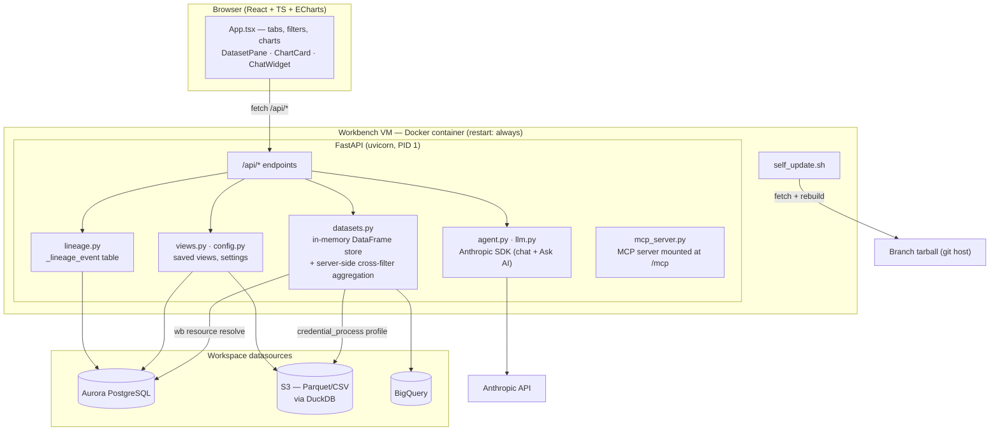
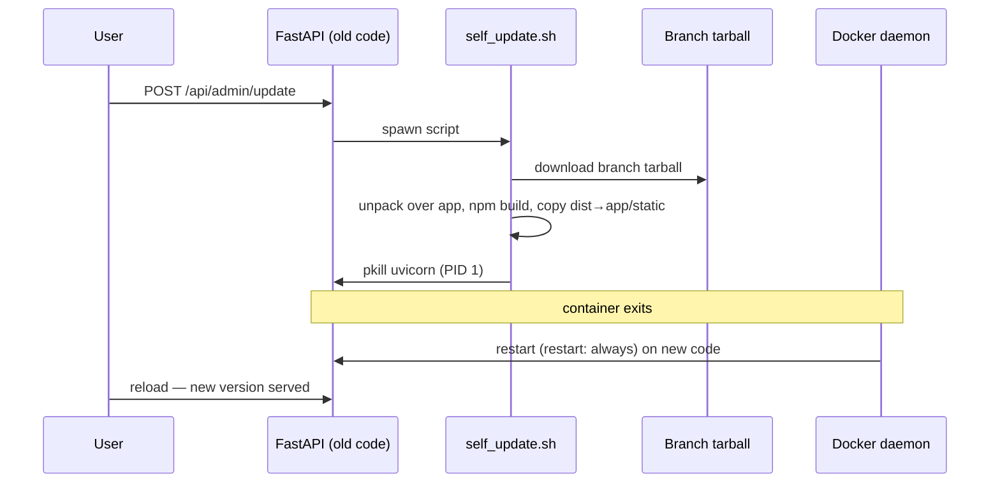
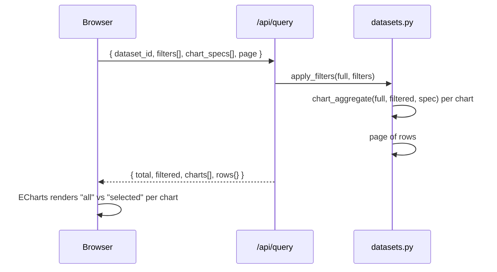

# Cohort Studio — architecture & flows

Diagrams for how the app is put together and how the two non-obvious
flows (restart-to-deploy "Update", and a state round-trip) work. Render
with any Mermaid-aware viewer (GitHub renders these inline).

## 1. Overall architecture

Credential model: Aurora creds come from `wb resource resolve` (ABAC,
per-resource); S3 access uses a `credential_process` AWS profile wired by
`wb workspace configure-aws`, exported into a DuckDB `SECRET ... PROVIDER
config` (DuckDB can't run `credential_process` itself).

## 2. Restart-to-deploy — what "Update" does

The container runs uvicorn as PID 1 under `restart: always`. Updating is:
pull the branch, rebuild the frontend, then kill PID 1 so Docker restarts
it on the new code. No VM recreate.

## 3. One state round-trip (filter / chart change)

The frontend is thin: it sends the current filter set and the charts it
is showing; the server returns counts, per-chart aggregates (full and
filtered cohort), and one page of rows — everything for a render in a
single call. All statistics stay server-side.

Aggregation has two interchangeable backends behind the same response
shape: pandas (`datasets.py`) for small frames, and DuckDB SQL over the
in-memory frame (`agg_duck.py`) once row count crosses
`STUDIO_DUCKDB_AGG_ROWS` (default 50k). The DuckDB path pushes filtering,
group/count, binning and paging into a vectorised columnar engine; parity
tests pin its output to the pandas path, and any DuckDB error falls back
to pandas rather than failing the query.

## 4. Saved views / state persistence

A saved view captures every open tab (datasource-backed ones — uploads
can't be reloaded) with its filters and charts, into Aurora (a
`_studio_views` row) or S3 (a JSON object), so state survives the app
closing. The in-memory DataFrame store is reconstructed by re-opening
each tab's datasource on load.
